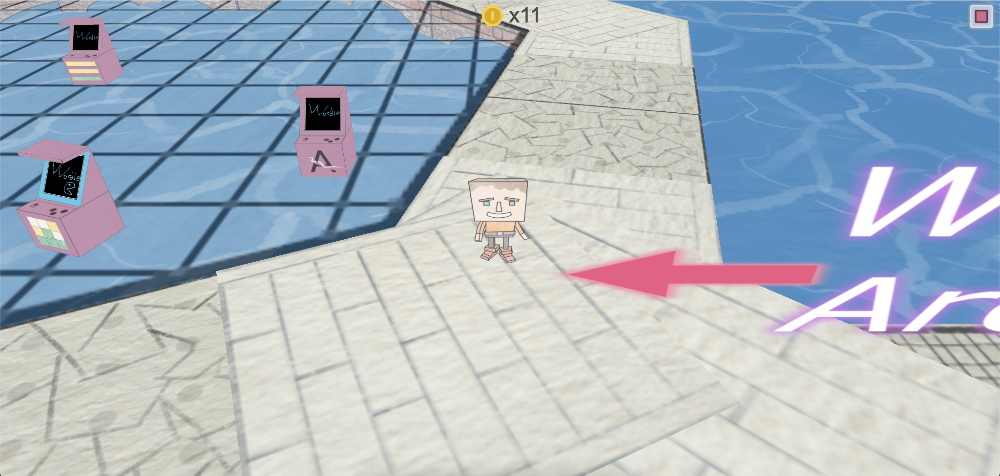

# 🕹️ WordGame Developer Log

This repository serves as a public developer log for an upcoming video game that blends classic arcade mechanics with word-based gameplay. It documents the project’s evolution from early concepts through prototyping and implementation, capturing design decisions, technical challenges, and creative experiments along the way. Updates may include gameplay ideas, system architecture notes, and reflections on how fast-paced arcade action can be meaningfully combined with language, vocabulary, and wordplay to create a distinctive player experience.

***

 ## ⚙️ Gameplay:

Tap anywhere on the screen to make your character walk to that spot.
 
Collect coins to unlock and play arcade minigames.

    

  <a href="https://hielo777.github.io/WordGameDevLog/">
    Click here to try the demo >>
  </a>

(<a href="#readme-top">⬆  back to top  ⬆</a>)

***

## 📋 To Do:

&nbsp;&nbsp;&nbsp;&nbsp;Roadmap and musings <small>(Click here for full explanation)</small>

(<a href="#readme-top">⬆  back to top  ⬆</a>)

(<a href="#readme-top">⬆  back to top  ⬆</a>)
